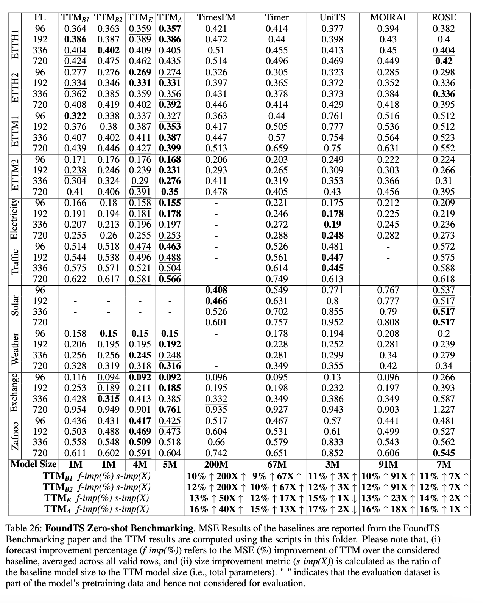

# NOTE TO FOUNDTS LEADERBOARD TEAM


- [FoundTS-Leaderboard](https://arxiv.org/abs/2410.11802) provides a general benchmarking framework for zero-shot and few-shot forecasting using time-series foundation models.
- Thanks to the authors of the paper for providing this benchmarking system which is very essential in the current literature space.
- However, we observe that the TTM numbers reported as part of the benchmarking is not computed correctly. Hence we are sharing the scripts here to rightly run the TTM models on the benchmarked datasets (ETTH1, ETTH2, ETTM1, ETTM2, Weather, Traffic, Electricity, Zafnoo, Exchange). Please note that, Solar dataset is used as part of the TTM pretraining. Hence TTM's results on Solar is extremely good and should not be considered for Zero-shot evaluation. Likewise, Weather and Electricity is part of TimesFM pretraining data and Traffic is part of both TimesFM and Moirai. Hence, we should exclude these results in zero/few-shot comparisons.
- Since TTM requires atleast 512 time-points in the context length, we ignore short-context length datasets such as ILI, NASDAQ, NN5, Wike2000 where TTM cannot be applied currently.
- We request the authors to update their benchmarking/leaderboard table accordingly.
- As per the below zeroshot results, TTM outperform most of the datasets by a good margin. 


# Updated Zeroshot FoundTS Table with correct TTM numbers




# Steps to reproduce

## Fetching the data
The evaluation data can be downloaded from any of the previous time-series github repos like autoformer or timesnet or informer or foundTS repo. [Sample download link](https://drive.google.com/drive/folders/1vE0ONyqPlym2JaaAoEe0XNDR8FS_d322). The ETT datasets can also be downloaded from [ETT-Github-Repository](https://github.com/zhouhaoyi/ETDataset). 

Download and save the datasets in a directory. For example, in `data_root_path`. 

CSVs of each data should reside in location `data_root_path/$dataset_name/$dataset_name.csv` for our data utils to process them automatically.


## Running the scripts

1. In terminal, run `sh ttm-a-1536.sh`
2. Run `summarize_results.py`. For example, 

```
sh ttm-a-1536.sh data_root_path/
python summarize_results.py -rd=results-ttm-a/
```

It will run all benchmarking and dump the results. The dumped results are available in the CSV files. 

## Different TTM Models:
- TTM-B1: Refers to TTM results with 512 context length and frequency prefix tuning enabled: `ttm-b1-512.sh`
- TTM-B2: Refers to TTM results with 512 context length: `ttm-b1-512.sh`
- TTM-E: Refers to TTM results with 1024 context length: `ttm-b1-512.sh`
- TTM-A: Refers to TTM results with 1536 context length: `ttm-b1-512.sh`


